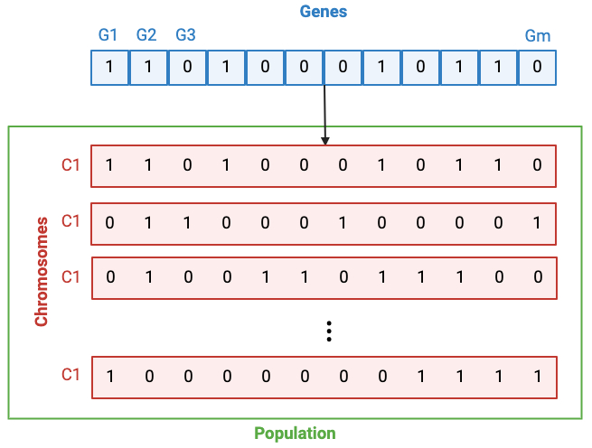

# Gentl
The source code for Gentl (<ins>GEN</ins>e<ins>T</ins>ic a<ins>L</ins>gorithm for predicting stage and grade from medical scans of patients with cancer) [[access preprint](doi-when-available)].

<!------------------>

# About

This is a repository that contains information on how to reproduce results corresponding to the *bladder cancer* case study reported in [Paper title](https://paper-doi-when-available).

<!------------------>

# Abstract

This is a repository that contains information on how to reproduce results corresponding to the *bladder cancer* case study reported in [Paper title](https://paper-doi-when-available).

<!------------------>

# Data


## Description

- As described in our [paper](https://www.mdpi.com/2072-6694/15/6/1673), the data used for our analyses comprised a total of 100 CT scans of the bladder, each from a patient with bladder cancer.

- Disease: urothelial carcinoma of the bladder

- Stages: Ta, Tis, T0, T1, T2, T3, T4

- Stage annotation technique: Performed manually by radiologists

For more details, interested readers are directed to the **Dataset** section of the [paper](https://www.mdpi.com/2072-6694/15/6/1673).

## Availability

Data will be made available under reasonable request to the corresponding author, <a href="mailto:suryadipto.sarkar@fau.de">Suryadipto Sarkar</a> (more contact details below).

<!------------------>

# Data preprocessing

## Otsu's thresholding


<br/>

## Overall ROI bounding box selection

Done using hyperparameter that takes as input the choice of the user, as follows:

- Mode 1: Circum-rectangle

- Mode 2: Inner rectangle derived using elipse

- Mode 3 (default): In-rectangle

<br/>


## Smaller ROI bounding box selection from healthy tissue

Smaller ROI bounding box selection is done using a sliding window implementation, from healthy areas of the tissue, binarized features extracted from which are subsequently used as the initial population for the genetic algorithm.

Note that the binarized feature extracted from the cancer ROI of the same image is subsequently used as the target (also known as, goal) for the genetic algorithm.

Reported results have used initial population size as {10, 20, 50, 100, 500, 1000}. Reported results have also healthy areas with constant size across the image samples, although this was not really necessary since we are using binarized GLCM texture features from the ROIs and not the ROIs themselves as input to the genetic algorithm.

<!------------------>

# Feature extraction

The following five GLCM features were extracted from the cancer ROI, as well as healthy ROIs from the same patient:

- Dissimilarity
- Correlation
- Energy
- Contrast
- Homogeneity,

using $20$ configurations ($4$ angles: $\{0, \frac{\pi}{4}, \frac{\pi}{2}, \frac{3\pi}{4} \}$; $5$ distances: $\{1, 2, 3,5, 7\}$ pixels).

<!------------------>

# Feature binarization

- Performed on the cancer ROI using bimodal Gaussian mixture model (GMM) fitting using the ** package. All feature values that are closer in Euclidean distance to lower mean ($\mu_1$) is assigned a value of $0$, else $1$ if closer to higher mean ($\mu_2$).
- All healthy ROI feature values from the same image sample are assigned a value of $0$ if they are closer in Euclidean distance to the lower mean ($\mu_1$) obtained from the **cancer ROI above**, else assigned a value of $1$ if closer to $\mu_2$.

*Note*: Bimodal GMM fitting only done once per image, pertaining to the cancer ROI. Feature binarization of healthy ROIs performed based on mean values obtained from bimodal GMM fitting on the **cancer ROI** pertaining to the same image sample.


<!------------------>

# Genetic algorithm

## General information about our implementation of the algorithm

- We perform the genetic algorithm on each sample image separately.


## An overview of the terms *gene*, *chromosome* and *population*




## Algorithmic workflow


### Step 1: Population initialization

- The initial population ($P$) comprises binarized GLCM features extracted from the healthy ROIs.

- Reported results include $P=\{10, 20, 50, 100, 500, 1000\}$.


### Step 2: Parent selection by fitness evaluation

- Fitness metric: Euclidean distance to target.
	- In our implementation target is binarized feature list from cancer ROI.

- Parent selection rate: $50\%$ of the population at the end of iteration *$i$* is retained as parents for iteration *$i+1$*. Therefore, list of selected parents contains top $50\%$ of the chromosomes closest to the target sequence.

### Step 3: Crossover (initial offspring generation)

- For crossover between two parents:
	- The first parent ($p_1$) is always chosen from the top $50\%$ of chromosomes (that is, ones having least Euclidean distance to the target sequence).
	- The second parent ($p_2$) is chosen from the initial population at each iteration.

- Random portions of parents $p_1$ and $p_2$ constitute the respective child--with at least one gene compulsorily selected from each parent \{ $p_1$ , $p_2$ \}.

### Step 4: Mutation (final offspring generation)

- Initial offspring $\overline{o_{1,2}}$ generated from parents $p_1$ and $p_2$ in step 3 (crossover) described above, undergoes mutation to give rise to final offspring $o_{1,2}$.


<!------------------>

# Installation

Install conda environment as follows (there also exists a requirements.txt)
```bash
conda create --name imaging_heterogeneity_study
conda activate imaging_heterogeneity_study
pip install scipy==1.10.1 numpy==1.23.5 squidpy==1.3.0 pandas==1.5.3 scikit-learn==1.2.2
```
*Note:* Additionally, modules *math* and *statistics* were used, however no installation is required as they are provided with Python by default.

<!------------------>

# Robustness testing

Pending

<!------------------>

# Scalability testing

Pending

<!------------------>

# Reproducing figures

Pending

<!------------------>

# Citing the work

## MLA

Will be made available upon publication.

## APA

Will be made available upon publication.

## BibTex

Will be made available upon publication.

<!------------------>

# Contact

&#x2709;&nbsp;&nbsp;suryadipto.sarkar@fau.de<br/>
&#x2709;&nbsp;&nbsp;ssarka34@asu.edu<br/>
&#x2709;&nbsp;&nbsp;ssarkarmanipal@gmail.com

<!------------------>

# Impressum

Suryadipto Sarkar ("Surya"), MS<br/><br/>
PhD Candidate<br/>
Biomedical Network Science Lab<br/>
Department of Artificial Intelligence in Biomedical Engineering (AIBE)<br/>
Friedrich-Alexander University Erlangen-Nürnberg (FAU)<br/>
Werner von Siemens Strasse<br/>
91052 Erlangen<br/><br/>
MS in CEN from Arizona State University, AZ, USA.<br/>
B.Tech in ECE from MIT Manipal, KA, India.
