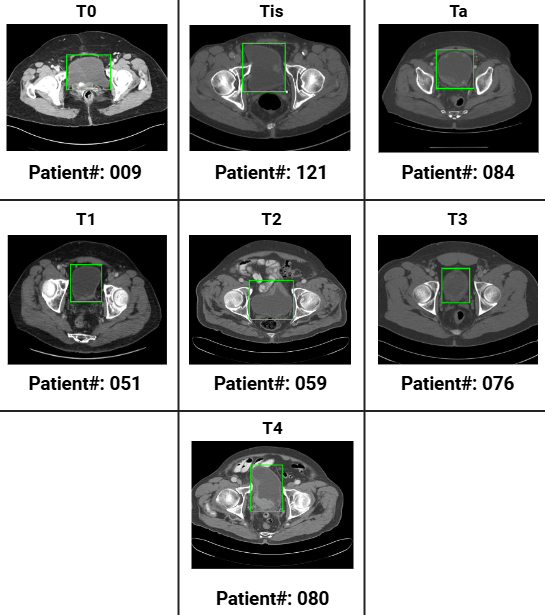
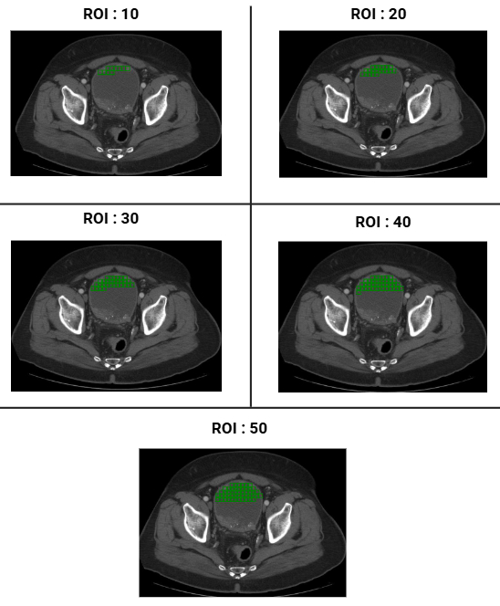

# Gentl
The source code for Gentl (<ins>GEN</ins>e<ins>T</ins>ic a<ins>L</ins>gorithm for predicting stage from medical scans of patients with cancer) [[access preprint](doi-when-available)].

<!------------------>

# About

This is a repository that contains information on how to reproduce results corresponding to the *bladder cancer* case study reported in [Paper title](https://paper-doi-when-available).

<!------------------>

# Abstract

This is a repository that contains information on how to reproduce results corresponding to the *bladder cancer* case study reported in [Paper title](https://paper-doi-when-available).

<!------------------>

# Data


## Description

- As described in our [paper](https://www.mdpi.com/2072-6694/15/6/1673), the data used for our analyses comprised a total of 100 CT scans of the bladder, each from a patient with bladder cancer.

- Disease: urothelial carcinoma of the bladder

- Stages: Ta, Tis, T0, T1, T2, T3, T4

- Stage annotation technique: Performed manually by radiologists

For more details, interested readers are directed to the **Dataset** section of the [paper](https://www.mdpi.com/2072-6694/15/6/1673).

## Availability

Data will be made available under reasonable request to the corresponding author, <a href="mailto:suryadipto.sarkar@fau.de">Suryadipto Sarkar</a> (more contact details below).

<!------------------>

# Data preprocessing

## Step 1: Segmenting bladder region using ImageJ



<br/>

## Step 2: Segmenting cancer ROI using binary mask


## Step 3: Segmenting healthy ROIs using sliding window




# Feature extraction

The following five GLCM features were extracted from the cancer ROI, as well as healthy ROIs from the same patient:

- Dissimilarity
- Correlation
- Energy
- Contrast
- Homogeneity,

using $20$ configurations ($4$ angles: $\{0, \frac{\pi}{4}, \frac{\pi}{2}, \frac{3\pi}{4} \}$; $5$ distances: $\{1, 2, 3,4, 5\}$ pixels).

<!------------------>

# Feature binarization


- Performed on the cancer ROI using bimodal Gaussian mixture model (GMM) fitting using the sklearn.mixture package. All feature values that are closer in Euclidean distance to lower mean ($\mu_1$) is assigned a value of $0$, else $1$ if closer to higher mean ($\mu_2$).
- All healthy ROI feature values from the same image sample are assigned a value of $0$ if they are closer in Euclidean distance to the lower mean ($\mu_1$) obtained from the **cancer ROI above**, else assigned a value of $1$ if closer to $\mu_2$.

*Note*: Bimodal GMM fitting only done once per image, pertaining to the cancer ROI. Feature binarization of healthy ROIs performed based on mean values obtained from bimodal GMM fitting on the **cancer ROI** pertaining to the same image sample.


<!------------------>

# Genetic algorithm

## General information about our implementation of the algorithm

- We perform the genetic algorithm on each sample image separately.


## An overview of the terms *gene*, *chromosome* and *population*


## Algorithmic workflow


### Step 1: Population initialization

- The initial population ($P$) comprises binarized GLCM features extracted from the healthy ROIs.

- Reported results include $P=\{10, 20, 30, 40, 50\}$.


### Step 2: Parent selection by fitness evaluation

- Fitness metric: Euclidean or Absolute distance to target.
	- In our implementation target is binarized feature list from cancer ROI.

- Parent selection rate: 50% of the population at the end of iteration _i_ is retained as parents for iteration _i+1_. Therefore, list of selected parents contains top 50% of the chromosomes closest to the target sequence.

### Step 3: Crossover (initial offspring generation)


- For crossover between two parents:
	- The first parent ($p_1$) is always chosen from the top 50% of chromosomes (that is, ones having least Absolute distance to the target sequence).
	- The second parent ($p_2$) is chosen from the initial population at each iteration.

- Random portions of parents $p_1$ and $p_2$ constitute the respective offspring&mdash;with at least one gene compulsorily selected from each parent \{ $p_1$ , $p_2$ \}.

### Step 4: Mutation (final offspring generation)


- Initial offspring $\overline{o_{1,2}}$ generated from parents $p_1$ and $p_2$ in step 3 (crossover) described above, undergoes mutation to give rise to final offspring $o_{1,2}$.

### Step 5: Replacement

- In this step, we replace the worst-performing individuals in the current population with new offspring, retaining the better-performing individuals.

- In the script */gentl/\_ga\_step5\_replacement.py*:
	- Input parameters:
    	- `population`: The current population.
    	- `new_generation`: The new generation of chromosomes.
    	- `goal`: The target sequence.

    - Returns:
    	- `best_individuals`: The updated population containing the best individuals.

	
# Installation

Create a virtual environment and install the dependencies using requirements.txt
```bash
python -m venv gentlvenv
gentlvenv\Scripts\activate # Windows
source gentlvenv/bin/activate # Mac/Linux
pip install -r requirements.txt
```

<!------------------>

# Key metrics for cancer staging

Using Genetic Algorithm (GA), we compute **three key metrics** to quantify feature similarity between non-cancer and cancer regions, which are essential for cancer staging:

- `average_generation`:  
  The average number of iterations required for GA convergence (averaged over 20 runs).  
  - Lower values indicate faster convergence and higher similarity between non-cancer and cancer features.

- `average_best_distance`:  
  The average distance between the best solution (most similar to cancer) and the target cancer feature (final generation, averaged over 20 runs).  
  - Lower values suggest that some non-cancer regions closely resemble cancer regions.

- `average_mean_distance`:  
  The average distance between the whole population and the target (final generation, averaged over 20 runs).  
  - Reflects how well the entire population approximates cancer-like features, indicating diversity and convergence quality.

# Robustness tests

We designed tests to evaluate whether GA remains stable and reliable under different settings:

- **Random initialization test**:  
  Run GA under 10 different random seeds, each repeated 20 times, to assess whether convergence speed and time are consistent across random initializations.

- **Mutation rate test**:  
  Test GA performance under various mutation rates (`0.001`, `0.05`, `0.1`, `0.15`, `0.9`) to analyze how mutation influences diversity and convergence.

- **Population capacity (Np) test**:  
  Examine how different offspring population sizes (`25`, `26`, `28`, `30`, `40`, `50`, `60`) affect GA's ability to avoid local optima and achieve stable solutions.

These tests ensure that GA performs consistently without being overly sensitive to random factors or hyperparameters.

<!------------------>

# Scalability testing

We analyzed how GA scales when facing larger or more complex feature sets:

- **Chromosome Length Test**:  
  Vary chromosome lengths (`10` to `70`) to examine how problem size impacts convergence time and iterations.

- **Max Generation Limit Test**:  
  Vary the maximum number of allowed generations (`35` to `80`) to confirm whether GA typically converges before hitting the limit.

- **Population Size Test**:  
  Vary population sizes (`20`, `40`, `60`, `80`, `100`) to evaluate trade-offs between diversity and runtime efficiency.

These tests validate that GA remains feasible and efficient even as the complexity of the feature space increases.


<!------------------>

# Citing the work

## MLA

Will be made available upon publication.

## APA

Will be made available upon publication.

## BibTex

Will be made available upon publication.

<!------------------>

# Contact

&#x2709;&nbsp;&nbsp;suryadipto.sarkar@fau.de<br/>
&#x2709;&nbsp;&nbsp;ssarka34@asu.edu<br/>
&#x2709;&nbsp;&nbsp;ssarkarmanipal@gmail.com

<!------------------>

# Impressum

Suryadipto Sarkar ("Surya"), MS<br/><br/>
PhD Candidate<br/>
Biomedical Network Science Lab<br/>
Department of Artificial Intelligence in Biomedical Engineering (AIBE)<br/>
Friedrich-Alexander University Erlangen-Nürnberg (FAU)<br/>
Werner von Siemens Strasse<br/>
91052 Erlangen<br/><br/>
MS in CEN from Arizona State University, AZ, USA.<br/>
B.Tech in ECE from MIT Manipal, KA, India.
