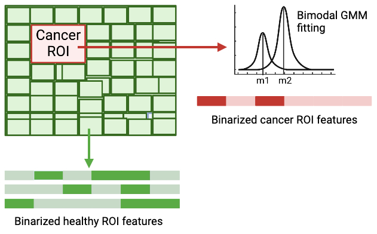

# Gentl
The source code for Gentl (<ins>GEN</ins>e<ins>T</ins>ic a<ins>L</ins>gorithm for predicting stage and grade from medical scans of patients with cancer) [[access preprint](doi-when-available)].

<!------------------>

# About

This is a repository that contains information on how to reproduce results corresponding to the *bladder cancer* case study reported in [Paper title](https://paper-doi-when-available).

<!------------------>

# Abstract

This is a repository that contains information on how to reproduce results corresponding to the *bladder cancer* case study reported in [Paper title](https://paper-doi-when-available).

<!------------------>

# Data


## Description

- As described in our [paper](https://www.mdpi.com/2072-6694/15/6/1673), the data used for our analyses comprised a total of 100 CT scans of the bladder, each from a patient with bladder cancer.

- Disease: urothelial carcinoma of the bladder

- Stages: Ta, Tis, T0, T1, T2, T3, T4

- Stage annotation technique: Performed manually by radiologists

For more details, interested readers are directed to the **Dataset** section of the [paper](https://www.mdpi.com/2072-6694/15/6/1673).

## Availability

Data will be made available under reasonable request to the corresponding author, <a href="mailto:suryadipto.sarkar@fau.de">Suryadipto Sarkar</a> (more contact details below).

<!------------------>

# Data preprocessing

## Otsu's thresholding


<br/>

## Overall ROI bounding box selection

Done using hyperparameter that takes as input the choice of the user, as follows:

- Mode 1: Circum-rectangle

- Mode 2: Inner rectangle derived using elipse

- Mode 3 (default): In-rectangle

<br/>


## Smaller ROI bounding box selection from healthy tissue

Smaller ROI bounding box selection is done using a sliding window implementation, from healthy areas of the tissue, binarized features extracted from which are subsequently used as the initial population for the genetic algorithm.

Note that the binarized feature extracted from the cancer ROI of the same image is subsequently used as the target (also known as, goal) for the genetic algorithm.

Reported results have used initial population size as {10, 20, 50, 100, 500, 1000}. Reported results have also healthy areas with constant size across the image samples, although this was not really necessary since we are using binarized GLCM texture features from the ROIs and not the ROIs themselves as input to the genetic algorithm.

<!------------------>

# Feature extraction

The following five GLCM features were extracted from the cancer ROI, as well as healthy ROIs from the same patient:

- Dissimilarity
- Correlation
- Energy
- Contrast
- Homogeneity,

using $20$ configurations ($4$ angles: $\{0, \frac{\pi}{4}, \frac{\pi}{2}, \frac{3\pi}{4} \}$; $5$ distances: $\{1, 2, 3,5, 7\}$ pixels).

<!------------------>

# Feature binarization



- Performed on the cancer ROI using bimodal Gaussian mixture model (GMM) fitting using the ** package. All feature values that are closer in Euclidean distance to lower mean ($\mu_1$) is assigned a value of $0$, else $1$ if closer to higher mean ($\mu_2$).
- All healthy ROI feature values from the same image sample are assigned a value of $0$ if they are closer in Euclidean distance to the lower mean ($\mu_1$) obtained from the **cancer ROI above**, else assigned a value of $1$ if closer to $\mu_2$.

*Note*: Bimodal GMM fitting only done once per image, pertaining to the cancer ROI. Feature binarization of healthy ROIs performed based on mean values obtained from bimodal GMM fitting on the **cancer ROI** pertaining to the same image sample.


<!------------------>

# Genetic algorithm

## General information about our implementation of the algorithm

- We perform the genetic algorithm on each sample image separately.


## An overview of the terms *gene*, *chromosome* and *population*


## Algorithmic workflow


### Step 1: Population initialization

- The initial population ($P$) comprises binarized GLCM features extracted from the healthy ROIs.

- Reported results include $P=\{10, 20, 50, 100, 500, 1000\}$.


### Step 2: Parent selection by fitness evaluation

- Fitness metric: Euclidean distance to target.
	- In our implementation target is binarized feature list from cancer ROI.

- Parent selection rate: $50\%$ of the population at the end of iteration *$i$* is retained as parents for iteration *$i+1$*. Therefore, list of selected parents contains top $50\%$ of the chromosomes closest to the target sequence.

### Step 3: Crossover (initial offspring generation)


- For crossover between two parents:
	- The first parent ($p_1$) is always chosen from the top $50\%$ of chromosomes (that is, ones having least Euclidean distance to the target sequence).
	- The second parent ($p_2$) is chosen from the initial population at each iteration.

- Random portions of parents $p_1$ and $p_2$ constitute the respective offspring&mdash;with at least one gene compulsorily selected from each parent \{ $p_1$ , $p_2$ \}.

### Step 4: Mutation (final offspring generation)


- Initial offspring $\overline{o_{1,2}}$ generated from parents $p_1$ and $p_2$ in step 3 (crossover) described above, undergoes mutation to give rise to final offspring $o_{1,2}$.

### Step 5: Replacement

- In this step, we replace the worst-performing individuals in the current population with new offspring, retaining the better-performing individuals.

- In the script */gentl/\_ga\_step5\_replacement.py*:
	- Input parameters:
    	- `population`: The current population.
    	- `new_generation`: The new generation of chromosomes.
    	- `goal`: The target sequence.

    - Returns:
    	- `best_individuals`: The updated population containing the best individuals.


## Intermediate results

### 1. Average distance

#### i. Dissimilarity

| patient_id | average_distance    |
| ---------- | ------------------- |
| CT-073     | 0                   |
| CT-076     | 0.4121320343559643  |
| CT-112     | 0.45                |
| CT-147     | 0.4707106781186548  |
| CT-055     | 0.48660254037844386 |
| CT-067     | 0.5207106781186548  |
| CT-111     | 0.5621320343559643  |
| CT-125     | 0.5828427124746189  |
| CT-062     | 0.6121320343559642  |
| CT-101     | 0.6487345747344081  |
| CT-159     | 0.6707106781186548  |
| CT-156     | 0.68284271          |
| CT-131     | 0.7121320343559642  |
| CT-102     | 0.7121320343559643  |
| CT-051     | 0.73284271          |
| CT-015     | 0.7535533905932738  |
| CT-169     | 0.7535533905932738  |
| CT-011     | 0.7621320343559643  |
| CT-150     | 0.7780238966157534  |
| CT-153     | 0.78284271          |
| CT-165     | 0.79873457          |
| CT-052     | 0.7987345747344081  |
| CT-108     | 0.8073132184970987  |
| CT-140     | 0.8121320343559641  |
| CT-120     | 0.8242640687119286  |
| CT-084     | 0.8401559309717175  |
| CT-134     | 0.8815772872090271  |
| CT-184     | 0.8815772872090271  |
| CT-158     | 0.9035533905932738  |
| CT-139     | 0.9035533905932738  |
| CT-096     | 0.9121320343559642  |
| CT-083     | 0.9242640687119286  |
| CT-087     | 0.9522879653276819  |
| CT-023     | 0.9608666090903725  |
| CT-105     | 0.9608666090903725  |
| CT-115     | 0.9767584713501615  |
| CT-080     | 0.9767584713501615  |
| CT-097     | 0.9815772872090271  |
| CT-054     | 0.9888905057061258  |
| CT-160     | 0.9901559309717177  |
| CT-053     | 1.0156854249492382  |
| CT-172     | 1.0267584713501614  |
| CT-175     | 1.0315772872090272  |
| CT-174     | 1.0437093215649915  |
| CT-107     | 1.052287965327682   |
| CT-154     | 1.0767584713501617  |
| CT-098     | 1.091384908344359   |
| CT-123     | 1.0974691494688162  |
| CT-059     | 1.105841355920956   |
| CT-012     | 1.106047793231507   |
| CT-143     | 1.1133610117286055  |
| CT-099     | 1.1254930460845698  |
| CT-163     | 1.1426503336099505  |
| CT-129     | 1.154782367965915   |
| CT-118     | 1.1596011838247806  |
| CT-178     | 1.1633610117286053  |
| CT-136     | 1.1754930460845698  |
| CT-127     | 1.1888905057061259  |
| CT-104     | 1.2096011838247807  |
| CT-056     | 1.2096011838247807  |
| CT-167     | 1.2120955864630134  |
| CT-075     | 1.2169144023218794  |
| CT-137     | 1.220674230225704   |
| CT-117     | 1.2372964449595591  |
| CT-042     | 1.254782367965915   |
| CT-121     | 1.2754930460845697  |
| CT-029     | 1.2804818513610357  |
| CT-106     | 1.2865660924854931  |
| CT-164     | 1.2899494936611666  |
| CT-041     | 1.2962037242032245  |
| CT-100     | 1.2962037242032245  |
| CT-176     | 1.307276770604148   |
| CT-090     | 1.3401194830787673  |
| CT-155     | 1.358007123078214   |
| CT-069     | 1.366914402321879   |
| CT-142     | 1.3694088049601123  |
| CT-133     | 1.3849720317389265  |
| CT-124     | 1.3853006672199013  |
| CT-025     | 1.390119483078767   |
| CT-065     | 1.4060113453385559  |
| CT-071     | 1.4194088049601121  |
| CT-144     | 1.4594425377614062  |
| CT-086     | 1.4642613536202718  |
| CT-128     | 1.4690801694791373  |
| CT-177     | 1.4877950698581341  |
| CT-179     | 1.4877950698581344  |
| CT-151     | 1.5328062645816685  |
| CT-049     | 1.5670843917394797  |
| CT-119     | 1.5895588788786383  |
| CT-024     | 1.5897908475977922  |
| CT-138     | 1.6260647524952614  |
| CT-126     | 1.6365660924854932  |
| CT-074     | 1.681515066763811   |
| CT-016     | 1.6935506755016168  |
| CT-091     | 1.765161695511938   |
| CT-009     | 1.8362738494800213  |
| CT-060     | 1.8814552747648183  |
| CT-109     | 1.9161348777720577  |
| CT-146     | 2.2703445712319095  |
| CT-047     | 2.446825225253918   |

#### ii. Correlation

| patient_id | average_distance   |
| ---------- | ------------------ |
| CT-172     | 0.5207106781186548 |
| CT-016     | 0.5914213562373095 |
| CT-029     | 0.5914213562373095 |
| CT-109     | 0.6121320343559643 |
| CT-124     | 0.6414213562373094 |
| CT-143     | 0.6414213562373094 |
| CT-099     | 0.6914213562373095 |
| CT-177     | 0.73284271         |
| CT-126     | 0.7414213562373095 |
| CT-153     | 0.7694452528530629 |
| CT-123     | 0.78284271         |
| CT-059     | 0.7987345747344081 |
| CT-087     | 0.8108666090903723 |
| CT-140     | 0.8121320343559644 |
| CT-125     | 0.8194452528530629 |
| CT-167     | 0.8242640687119286 |
| CT-076     | 0.9108666090903725 |
| CT-060     | 0.9121320343559642 |
| CT-164     | 0.9267584713501614 |
| CT-137     | 0.93284271         |
| CT-108     | 0.93533712         |
| CT-011     | 0.96462644         |
| CT-156     | 0.9901559309717177 |
| CT-062     | 1.0035533905932739 |
| CT-012     | 1.0242640687119287 |
| CT-090     | 1.0340716898472602 |
| CT-052     | 1.0401559309717177 |
| CT-042     | 1.0767584713501617 |
| CT-178     | 1.0865660924854932 |
| CT-158     | 1.1144199996836464 |
| CT-105     | 1.1317472766266277 |
| CT-075     | 1.1388905057061258 |
| CT-151     | 1.1499635521070493 |
| CT-184     | 1.1633610117286053 |
| CT-136     | 1.1669144023218794 |
| CT-127     | 1.1754930460845698 |
| CT-049     | 1.1888905057061259 |
| CT-091     | 1.1913849083443588 |
| CT-160     | 1.202287965327682  |
| CT-023     | 1.2096011838247807 |
| CT-107     | 1.2279874487228029 |
| CT-067     | 1.2279874487228029 |
| CT-074     | 1.2340716898472601 |
| CT-056     | 1.2365660924854933 |
| CT-117     | 1.2462037242032244 |
| CT-118     | 1.2474691494688164 |
| CT-128     | 1.254782367965915  |
| CT-179     | 1.2608666090903724 |
| CT-163     | 1.2644199996836463 |
| CT-097     | 1.2754930460845697 |
| CT-144     | 1.287625080440534  |
| CT-104     | 1.291384908344359  |
| CT-100     | 1.310501525716447  |
| CT-121     | 1.3217332181807449 |
| CT-146     | 1.3279874487228027 |
| CT-111     | 1.3317472766266276 |
| CT-080     | 1.3645899891012465 |
| CT-139     | 1.3781574381404031 |
| CT-154     | 1.3877950698581343 |
| CT-009     | 1.3983694913604825 |
| CT-142     | 1.4035169427003231 |
| CT-084     | 1.4372964449595593 |
| CT-138     | 1.4397908475977923 |
| CT-175     | 1.449269833252149  |
| CT-106     | 1.4494284793155237 |
| CT-047     | 1.451367735032367  |
| CT-165     | 1.4556827098575815 |
| CT-098     | 1.4560113453385561 |
| CT-024     | 1.4572767706041478 |
| CT-176     | 1.474227620818978  |
| CT-055     | 1.494779652874258  |
| CT-131     | 1.4986981268414574 |
| CT-159     | 1.5219032075983452 |
| CT-065     | 1.5276588132418278 |
| CT-147     | 1.5337066064733347 |
| CT-120     | 1.5377950698581344 |
| CT-015     | 1.5463737136208249 |
| CT-133     | 1.547104066094891  |
| CT-119     | 1.5645899891012467 |
| CT-086     | 1.580883568354127  |
| CT-150     | 1.5902892313527046 |
| CT-112     | 1.6028596717383734 |
| CT-025     | 1.6463737136208247 |
| CT-041     | 1.6495984687331238 |
| CT-174     | 1.6500001857262152 |
| CT-129     | 1.6972740555124912 |
| CT-053     | 1.7260647524952613 |
| CT-096     | 1.7433184656388003 |
| CT-051     | 1.745181369867349  |
| CT-115     | 1.7740689747556033 |
| CT-134     | 1.8010336422726527 |
| CT-054     | 1.8394622121168172 |
| CT-169     | 1.8696518758898288 |
| CT-155     | 1.8764042490431359 |
| CT-102     | 1.89179749         |
| CT-071     | 1.893587309120782  |
| CT-073     | 1.9537032504635623 |
| CT-101     | 2.093720182631891  |
| CT-083     | 2.0980514758027455 |
| CT-069     | 2.4094159809131144 |

#### iii. Energy

patient_id	average_distance
CT-055	0.15
CT-069	0.25
CT-083	0.45
CT-016	0.835337115
CT-098	0.8742640687119285
CT-076	0.9815772872090271
CT-100	0.9901559309717177
CT-073	1.0156854249492382
CT-052	1.0315772872090272
CT-087	1.0792528739883944
CT-065	1.1315772872090273
CT-086	1.1974691494688163
CT-104	1.2315772872090274
CT-105	1.2738989853380032
CT-060	1.2754930460845697
CT-124	1.2986981268414575
CT-091	1.3442077053199037
CT-118	1.3853006672199013
CT-143	1.389790847597792
CT-071	1.4035169427003231
CT-059	1.4413849083443588
CT-156	1.4549523573835152
CT-108	1.4581771124958145
CT-163	1.5102695569972933
CT-097	1.513726280828746
CT-090	1.5149917060943376
CT-062	1.5353006672199014
CT-184	1.5438793109825917
CT-129	1.543879310982592
CT-160	1.5511925294796904
CT-144	1.5536869321179234
CT-101	1.5674861087325707
CT-172	1.580883568354127
CT-125	1.6011925294796903
CT-074	1.612995928
CT-117	1.614759978518847
CT-080	1.6185195652790085
CT-158	1.6268920128748114
CT-119	1.6288877906144692
CT-029	1.6356404049114388
CT-053	1.6524945883644477
CT-099	1.6577751543590602
CT-115	1.665892047986004
CT-106	1.6745673585105156
CT-128	1.6760647524952614
CT-084	1.676892012874811
CT-107	1.6892302433976636
CT-011	1.6942810279756828
CT-112	1.7015942464727813
CT-164	1.714431101894209
CT-178	1.7264664694883525
CT-042	1.7421263630289876
CT-150	1.742686967229116
CT-142	1.7598442547544972
CT-015	1.767157473251596
CT-179	1.7862740906236838
CT-167	1.7912260211373217
CT-023	1.8096177433140828
CT-121	1.8103426385094092
CT-127	1.8137993623408621
CT-133	1.814334435132388
CT-147	1.8242384818858777
CT-136	1.8315573988053782
CT-120	1.8321489936197186
CT-134	1.8359452139990462
CT-138	1.8359454551427088
CT-159	1.848210604153445
CT-131	1.8557956949650412
CT-126	1.8562541751246098
CT-169	1.8571178833971103
CT-154	1.8603426385094095
CT-175	1.8726501195617131
CT-067	1.8851415388692012
CT-049	1.8898639291099084
CT-075	1.9165966279078042
CT-177	1.9277717983492881
CT-176	1.9385727312920509
CT-056	1.9451553561714205
CT-174	1.9451976882129884
CT-165	1.950206381893103
CT-102	1.9888415747740336
CT-024	1.998612321146536
CT-041	2.017270217215393
CT-140	2.037440179537568
CT-155	2.053544122112862
CT-012	2.093932021803734
CT-025	2.1013215917891275
CT-139	2.131471351966795
CT-047	2.1580763933886575
CT-123	2.166128692
CT-153	2.212349036172305
CT-054	2.2240280476474394
CT-009	2.2634276124491626
CT-096	2.2667547327456847
CT-137	2.3028054016265083
CT-146	2.3368961328998723
CT-111	2.370772301920929
CT-109	2.371522242716812
CT-151	2.3957091385513527
CT-051	2.425990406326662

#### iv. Contrast

| patient_id | average_distance   |
| ---------- | ------------------ |
| CT-073     | 0.2                |
| CT-101     | 0.63284271         |
| CT-080     | 0.7694452528530629 |
| CT-121     | 0.7742640687119285 |
| CT-052     | 0.8328427124746189 |
| CT-059     | 0.8901559309717175 |
| CT-160     | 0.9108666090903723 |
| CT-015     | 0.9121320343559642 |
| CT-156     | 0.91568542         |
| CT-098     | 0.9815772872090271 |
| CT-146     | 1.002287965327682  |
| CT-056     | 1.0096011838247807 |
| CT-062     | 1.1060477932315067 |
| CT-158     | 1.1292528739883945 |
| CT-137     | 1.1413849083443588 |
| CT-127     | 1.1522879653276819 |
| CT-155     | 1.154782367965915  |
| CT-143     | 1.154782367965915  |
| CT-144     | 1.1779874487228026 |
| CT-106     | 1.187625080440534  |
| CT-047     | 1.2229986434463367 |
| CT-097     | 1.2278174593052023 |
| CT-147     | 1.2620955864630137 |
| CT-111     | 1.2754930460845697 |
| CT-123     | 1.2888905057061257 |
| CT-119     | 1.3010225400620903 |
| CT-009     | 1.304782367965915  |
| CT-049     | 1.323898985338003  |
| CT-083     | 1.3276588132418277 |
| CT-118     | 1.3279874487228027 |
| CT-102     | 1.3424438962993999 |
| CT-124     | 1.3742276208189779 |
| CT-140     | 1.3986981268414573 |
| CT-172     | 1.4120955864630136 |
| CT-104     | 1.4163537981217507 |
| CT-134     | 1.4315408393160765 |
| CT-076     | 1.4365660924854933 |
| CT-151     | 1.4436471011197753 |
| CT-154     | 1.4605015257164469 |
| CT-115     | 1.4642613536202718 |
| CT-169     | 1.4678147442135454 |
| CT-174     | 1.4837430543662853 |
| CT-139     | 1.5097711732423809 |
| CT-128     | 1.5145899891012466 |
| CT-054     | 1.5760647524952613 |
| CT-055     | 1.5829762539992687 |
| CT-053     | 1.6089074649698802 |
| CT-126     | 1.6097711732423807 |
| CT-069     | 1.61299593         |
| CT-177     | 1.6192499177530748 |
| CT-138     | 1.6653369010646144 |
| CT-051     | 1.6781574381404027 |
| CT-016     | 1.6951811287236864 |
| CT-133     | 1.7149917060943376 |
| CT-142     | 1.7263366248097587 |
| CT-067     | 1.7310535577717268 |
| CT-120     | 1.7406911894894583 |
| CT-071     | 1.7438793109825916 |
| CT-131     | 1.7721462785280622 |
| CT-159     | 1.772839997382962  |
| CT-175     | 1.7887316184990887 |
| CT-100     | 1.7907642710015748 |
| CT-112     | 1.8083468607697515 |
| CT-074     | 1.809940921516318  |
| CT-087     | 1.8109741369190935 |
| CT-024     | 1.8360473380396065 |
| CT-176     | 1.838037899644188  |
| CT-060     | 1.8480774894986731 |
| CT-084     | 1.852299067538245  |
| CT-023     | 1.8591502947559342 |
| CT-086     | 1.8803229641539978 |
| CT-163     | 1.881126398140181  |
| CT-178     | 1.887409430067019  |
| CT-041     | 1.9227775357940833 |
| CT-108     | 1.9473468958809441 |
| CT-117     | 1.9666387188057086 |
| CT-107     | 1.9739153036836423 |
| CT-150     | 1.9811263981401808 |
| CT-025     | 1.9970182603999695 |
| CT-179     | 2.0134707268598873 |
| CT-012     | 2.017270217215393  |
| CT-136     | 2.024943061807678  |
| CT-184     | 2.027205254583095  |
| CT-164     | 2.0320865320308394 |
| CT-105     | 2.0496821701684773 |
| CT-167     | 2.0564970049106632 |
| CT-091     | 2.0594531576846435 |
| CT-129     | 2.0827057866181744 |
| CT-109     | 2.0923689516713786 |
| CT-029     | 2.101950061366295  |
| CT-165     | 2.10353842         |
| CT-090     | 2.116641747638225  |
| CT-065     | 2.1326012341313914 |
| CT-153     | 2.137425748412659  |
| CT-075     | 2.161485327899803  |
| CT-011     | 2.169945282685042  |
| CT-125     | 2.1983907312069575 |
| CT-099     | 2.200950624266585  |
| CT-042     | 2.256108936673326  |
| CT-096     | 2.3017741269350407 |

#### v. Homogeneity

| patient_id | average_distance   |
| ---------- | ------------------ |
| CT-060     | 0.4707106781186548 |
| CT-052     | 0.7121320343559642 |
| CT-051     | 0.7535533905932738 |
| CT-083     | 0.7621320343559642 |
| CT-075     | 0.8328427124746189 |
| CT-015     | 0.86944525         |
| CT-029     | 0.9035533905932738 |
| CT-087     | 0.9035533905932738 |
| CT-055     | 0.9656854249492379 |
| CT-158     | 1.0474691494688162 |
| CT-106     | 1.0754930460845695 |
| CT-069     | 1.1340716898472603 |
| CT-049     | 1.1510225400620901 |
| CT-065     | 1.1522879653276819 |
| CT-024     | 1.165685424949238  |
| CT-104     | 1.1729986434463366 |
| CT-042     | 1.2047823679659149 |
| CT-023     | 1.2565461769864192 |
| CT-163     | 1.2596011838247807 |
| CT-107     | 1.2754930460845697 |
| CT-179     | 1.3011925294796902 |
| CT-084     | 1.3120955864630137 |
| CT-090     | 1.3219032075983452 |
| CT-177     | 1.3328062645816683 |
| CT-164     | 1.3483694913604827 |
| CT-097     | 1.3531883072193485 |
| CT-156     | 1.3865660924854932 |
| CT-025     | 1.39261389         |
| CT-118     | 1.406011345338556  |
| CT-137     | 1.4215745721173705 |
| CT-119     | 1.4279874487228026 |
| CT-091     | 1.4535169427003232 |
| CT-098     | 1.4585057479767891 |
| CT-128     | 1.5145899891012464 |
| CT-121     | 1.5276588132418278 |
| CT-105     | 1.5362010091115679 |
| CT-142     | 1.5536869321179234 |
| CT-073     | 1.5540886491110149 |
| CT-138     | 1.5585057479767892 |
| CT-159     | 1.5617305030890882 |
| CT-100     | 1.5622655758806139 |
| CT-184     | 1.5654903309929131 |
| CT-126     | 1.5690801694791374 |
| CT-096     | 1.573168632863937  |
| CT-144     | 1.574932441884441  |
| CT-101     | 1.580554932873152  |
| CT-123     | 1.5886954117498007 |
| CT-129     | 1.5897908475977922 |
| CT-120     | 1.59178663         |
| CT-086     | 1.631382193252702  |
| CT-062     | 1.634108323466426  |
| CT-117     | 1.6556827098575813 |
| CT-175     | 1.6581771124958145 |
| CT-041     | 1.6649917060943378 |
| CT-125     | 1.6719032075983449 |
| CT-160     | 1.6781571969967402 |
| CT-108     | 1.6857023842129926 |
| CT-059     | 1.695643120003096  |
| CT-178     | 1.7049521162398524 |
| CT-012     | 1.7126672928737048 |
| CT-127     | 1.7129959283546796 |
| CT-011     | 1.7149917060943376 |
| CT-165     | 1.7294226222623323 |
| CT-131     | 1.7301898494992263 |
| CT-074     | 1.733146002273206  |
| CT-133     | 1.7540884079673513 |
| CT-151     | 1.7683864506242368 |
| CT-143     | 1.772839997382962  |
| CT-153     | 1.7846433962579518 |
| CT-139     | 1.7878681513702506 |
| CT-016     | 1.7921263630289874 |
| CT-169     | 1.7960448369961874 |
| CT-056     | 1.7967754306139163 |
| CT-147     | 1.803029420012311  |
| CT-174     | 1.8257361170142865 |
| CT-167     | 1.8263673742803075 |
| CT-134     | 1.8353737487320179 |
| CT-172     | 1.8494029479069205 |
| CT-009     | 1.8646630706133624 |
| CT-155     | 1.865563412505029  |
| CT-053     | 1.8710137267735785 |
| CT-150     | 1.872607787520145  |
| CT-067     | 1.881228763324404  |
| CT-124     | 1.8844111863951347 |
| CT-109     | 1.885317226709203  |
| CT-115     | 1.8941221407686453 |
| CT-136     | 1.8984789653481016 |
| CT-080     | 1.9028596717383732 |
| CT-140     | 1.9139324769956338 |
| CT-076     | 1.9179587199352173 |
| CT-154     | 1.9234114626499905 |
| CT-176     | 1.9690907894023746 |
| CT-112     | 1.9852148615249803 |
| CT-071     | 2.0519701909136074 |
| CT-102     | 2.0712565565596326 |
| CT-054     | 2.0857863267920087 |
| CT-099     | 2.1223918960029686 |
| CT-146     | 2.2957151780023928 |
| CT-111     | 2.4475525488954686 |
| CT-047     | 2.5500982756354307 |


### 2. Average generation


#### i. Dissimilarity

| patient_id | average_generation |
| ---------- | ------------------ |
| CT-073     | 0                  |
| CT-125     | 9.15               |
| CT-055     | 9.45               |
| CT-076     | 9.65               |
| CT-159     | 9.7                |
| CT-111     | 9.95               |
| CT-156     | 10.1               |
| CT-067     | 10.1               |
| CT-102     | 10.35              |
| CT-112     | 10.5               |
| CT-087     | 10.85              |
| CT-140     | 10.95              |
| CT-084     | 11                 |
| CT-150     | 11.25              |
| CT-147     | 11.5               |
| CT-165     | 11.55              |
| CT-120     | 11.6               |
| CT-108     | 11.75              |
| CT-062     | 11.8               |
| CT-153     | 11.95              |
| CT-053     | 11.95              |
| CT-052     | 12                 |
| CT-054     | 12.05              |
| CT-051     | 12.2               |
| CT-097     | 12.25              |
| CT-131     | 12.3               |
| CT-011     | 12.45              |
| CT-172     | 12.6               |
| CT-164     | 12.85              |
| CT-184     | 12.85              |
| CT-099     | 12.9               |
| CT-015     | 13.05              |
| CT-105     | 13.05              |
| CT-083     | 13.15              |
| CT-160     | 13.2               |
| CT-101     | 13.3               |
| CT-175     | 13.8               |
| CT-143     | 13.9               |
| CT-129     | 13.95              |
| CT-107     | 14.2               |
| CT-056     | 14.35              |
| CT-134     | 14.35              |
| CT-169     | 14.45              |
| CT-174     | 14.45              |
| CT-023     | 14.55              |
| CT-176     | 14.7               |
| CT-096     | 14.75              |
| CT-075     | 14.75              |
| CT-167     | 14.75              |
| CT-117     | 14.8               |
| CT-154     | 14.85              |
| CT-158     | 14.85              |
| CT-106     | 14.9               |
| CT-115     | 14.9               |
| CT-098     | 15                 |
| CT-136     | 15                 |
| CT-080     | 15.1               |
| CT-179     | 15.15              |
| CT-012     | 15.2               |
| CT-123     | 15.2               |
| CT-059     | 15.55              |
| CT-163     | 15.6               |
| CT-025     | 15.7               |
| CT-124     | 15.95              |
| CT-178     | 15.95              |
| CT-071     | 16.25              |
| CT-137     | 16.3               |
| CT-133     | 16.35              |
| CT-049     | 16.4               |
| CT-029     | 16.45              |
| CT-090     | 16.45              |
| CT-128     | 16.45              |
| CT-142     | 16.7               |
| CT-127     | 16.75              |
| CT-074     | 16.75              |
| CT-042     | 16.85              |
| CT-121     | 16.9               |
| CT-155     | 17.2               |
| CT-065     | 17.45              |
| CT-041     | 17.65              |
| CT-126     | 17.7               |
| CT-024     | 17.85              |
| CT-139     | 18.1               |
| CT-177     | 18.1               |
| CT-104     | 18.25              |
| CT-069     | 18.25              |
| CT-118     | 18.25              |
| CT-100     | 18.4               |
| CT-016     | 18.7               |
| CT-144     | 18.85              |
| CT-109     | 18.95              |
| CT-086     | 19.15              |
| CT-151     | 19.65              |
| CT-119     | 20.1               |
| CT-138     | 20.5               |
| CT-060     | 20.9               |
| CT-009     | 21.05              |
| CT-146     | 21.15              |
| CT-047     | 21.3               |
| CT-091     | 22.65              |

#### ii. Correlation

| patient_id | average_generation |
| ---------- | ------------------ |
| CT-177     | 9.7                |
| CT-059     | 10.6               |
| CT-060     | 10.75              |
| CT-124     | 11.3               |
| CT-126     | 11.55              |
| CT-143     | 11.65              |
| CT-125     | 11.75              |
| CT-121     | 12.1               |
| CT-111     | 12.4               |
| CT-160     | 12.45              |
| CT-109     | 12.5               |
| CT-056     | 12.65              |
| CT-011     | 12.7               |
| CT-117     | 12.85              |
| CT-140     | 12.85              |
| CT-137     | 13.35              |
| CT-172     | 13.35              |
| CT-099     | 13.65              |
| CT-156     | 13.95              |
| CT-097     | 14.1               |
| CT-105     | 14.1               |
| CT-076     | 14.35              |
| CT-062     | 14.4               |
| CT-123     | 14.4               |
| CT-144     | 14.4               |
| CT-016     | 14.45              |
| CT-052     | 14.65              |
| CT-075     | 14.75              |
| CT-091     | 14.85              |
| CT-074     | 14.95              |
| CT-024     | 15.05              |
| CT-098     | 15.25              |
| CT-042     | 15.3               |
| CT-009     | 15.4               |
| CT-087     | 15.45              |
| CT-127     | 15.45              |
| CT-055     | 15.5               |
| CT-153     | 15.6               |
| CT-049     | 15.65              |
| CT-090     | 15.75              |
| CT-146     | 15.8               |
| CT-164     | 15.8               |
| CT-179     | 15.85              |
| CT-167     | 15.95              |
| CT-023     | 16                 |
| CT-012     | 16.1               |
| CT-084     | 16.1               |
| CT-100     | 16.3               |
| CT-158     | 16.3               |
| CT-178     | 16.4               |
| CT-108     | 16.45              |
| CT-151     | 16.45              |
| CT-067     | 16.45              |
| CT-029     | 16.55              |
| CT-131     | 16.55              |
| CT-159     | 16.85              |
| CT-184     | 16.9               |
| CT-047     | 16.95              |
| CT-128     | 17                 |
| CT-119     | 17.35              |
| CT-136     | 17.35              |
| CT-129     | 17.4               |
| CT-133     | 17.5               |
| CT-163     | 17.6               |
| CT-150     | 17.7               |
| CT-104     | 17.8               |
| CT-041     | 17.85              |
| CT-051     | 17.9               |
| CT-120     | 17.9               |
| CT-107     | 17.95              |
| CT-118     | 17.95              |
| CT-142     | 17.95              |
| CT-174     | 17.95              |
| CT-065     | 18.05              |
| CT-175     | 18.05              |
| CT-169     | 18.35              |
| CT-054     | 18.4               |
| CT-138     | 18.6               |
| CT-155     | 18.7               |
| CT-154     | 18.8               |
| CT-176     | 18.9               |
| CT-096     | 19.05              |
| CT-015     | 19.15              |
| CT-102     | 19.2               |
| CT-134     | 19.5               |
| CT-071     | 19.55              |
| CT-139     | 19.75              |
| CT-080     | 19.85              |
| CT-112     | 19.9               |
| CT-053     | 20.05              |
| CT-025     | 20.25              |
| CT-106     | 20.4               |
| CT-073     | 20.45              |
| CT-165     | 20.5               |
| CT-147     | 21.15              |
| CT-115     | 21.25              |
| CT-086     | 22.85              |
| CT-083     | 23.3               |
| CT-069     | 23.5               |
| CT-101     | 23.55              |

#### iii. Energy

| patient_id | average_generation |
| ---------- | ------------------ |
| CT-069     | 5.35               |
| CT-083     | 5.95               |
| CT-055     | 8.15               |
| CT-073     | 12.8               |
| CT-076     | 13.1               |
| CT-087     | 14.3               |
| CT-100     | 14.3               |
| CT-052     | 14.5               |
| CT-098     | 14.7               |
| CT-074     | 15.2               |
| CT-118     | 15.4               |
| CT-016     | 15.45              |
| CT-090     | 16.1               |
| CT-060     | 16.1               |
| CT-086     | 16.4               |
| CT-062     | 16.65              |
| CT-144     | 16.75              |
| CT-112     | 16.8               |
| CT-124     | 16.8               |
| CT-163     | 17                 |
| CT-059     | 17.25              |
| CT-104     | 17.5               |
| CT-105     | 17.8               |
| CT-178     | 17.85              |
| CT-121     | 17.9               |
| CT-091     | 17.95              |
| CT-119     | 17.95              |
| CT-156     | 18.1               |
| CT-080     | 18.15              |
| CT-101     | 18.25              |
| CT-029     | 18.3               |
| CT-160     | 18.45              |
| CT-150     | 18.55              |
| CT-065     | 18.7               |
| CT-049     | 18.8               |
| CT-138     | 18.8               |
| CT-177     | 18.85              |
| CT-015     | 18.9               |
| CT-136     | 18.9               |
| CT-139     | 18.95              |
| CT-102     | 19                 |
| CT-154     | 19                 |
| CT-097     | 19.1               |
| CT-158     | 19.1               |
| CT-053     | 19.2               |
| CT-175     | 19.2               |
| CT-184     | 19.4               |
| CT-143     | 19.45              |
| CT-108     | 19.5               |
| CT-133     | 19.5               |
| CT-106     | 19.55              |
| CT-041     | 19.6               |
| CT-172     | 19.8               |
| CT-140     | 19.85              |
| CT-099     | 19.95              |
| CT-071     | 19.95              |
| CT-011     | 20.15              |
| CT-120     | 20.15              |
| CT-107     | 20.35              |
| CT-147     | 20.35              |
| CT-042     | 20.4               |
| CT-117     | 20.4               |
| CT-174     | 20.55              |
| CT-123     | 20.75              |
| CT-127     | 20.85              |
| CT-084     | 20.9               |
| CT-134     | 20.9               |
| CT-179     | 21                 |
| CT-155     | 21.05              |
| CT-167     | 21.05              |
| CT-165     | 21.15              |
| CT-067     | 21.2               |
| CT-176     | 21.2               |
| CT-009     | 21.25              |
| CT-131     | 21.25              |
| CT-047     | 21.6               |
| CT-051     | 21.65              |
| CT-128     | 21.65              |
| CT-164     | 21.65              |
| CT-129     | 21.75              |
| CT-125     | 21.8               |
| CT-142     | 21.8               |
| CT-115     | 21.85              |
| CT-159     | 22                 |
| CT-054     | 22                 |
| CT-126     | 22.05              |
| CT-153     | 22.1               |
| CT-151     | 22.4               |
| CT-096     | 22.5               |
| CT-169     | 22.6               |
| CT-012     | 22.8               |
| CT-025     | 23.05              |
| CT-109     | 23.2               |
| CT-056     | 23.2               |
| CT-146     | 23.25              |
| CT-111     | 23.75              |
| CT-023     | 23.9               |
| CT-137     | 23.9               |
| CT-075     | 24.1               |
| CT-024     | 24.85              |

#### iv. Contrast

| patient_id | average_generation |
| ---------- | ------------------ |
| CT-073     | 7.15               |
| CT-121     | 9.15               |
| CT-015     | 10.4               |
| CT-080     | 11.65              |
| CT-101     | 11.7               |
| CT-097     | 12.15              |
| CT-156     | 13.05              |
| CT-143     | 13.05              |
| CT-160     | 13.3               |
| CT-098     | 13.35              |
| CT-177     | 13.55              |
| CT-047     | 13.6               |
| CT-062     | 13.85              |
| CT-052     | 14.15              |
| CT-140     | 14.2               |
| CT-144     | 14.25              |
| CT-059     | 14.35              |
| CT-127     | 14.65              |
| CT-134     | 14.65              |
| CT-155     | 14.95              |
| CT-104     | 15.1               |
| CT-083     | 15.15              |
| CT-054     | 15.3               |
| CT-056     | 15.35              |
| CT-139     | 15.9               |
| CT-055     | 16                 |
| CT-175     | 16.1               |
| CT-172     | 16.25              |
| CT-158     | 16.35              |
| CT-106     | 16.4               |
| CT-137     | 16.6               |
| CT-111     | 16.65              |
| CT-053     | 16.85              |
| CT-146     | 17                 |
| CT-119     | 17.2               |
| CT-154     | 17.25              |
| CT-076     | 17.25              |
| CT-151     | 17.3               |
| CT-133     | 17.3               |
| CT-174     | 17.3               |
| CT-102     | 17.45              |
| CT-115     | 17.45              |
| CT-123     | 17.5               |
| CT-074     | 17.6               |
| CT-109     | 17.75              |
| CT-124     | 17.75              |
| CT-069     | 17.75              |
| CT-024     | 17.85              |
| CT-131     | 18.05              |
| CT-100     | 18.1               |
| CT-118     | 18.15              |
| CT-129     | 18.25              |
| CT-016     | 18.35              |
| CT-049     | 18.35              |
| CT-071     | 18.55              |
| CT-084     | 18.65              |
| CT-126     | 18.65              |
| CT-051     | 18.65              |
| CT-147     | 18.75              |
| CT-164     | 18.85              |
| CT-159     | 18.9               |
| CT-128     | 18.9               |
| CT-009     | 19.05              |
| CT-176     | 19.25              |
| CT-086     | 19.3               |
| CT-150     | 19.3               |
| CT-075     | 19.3               |
| CT-138     | 19.4               |
| CT-142     | 19.55              |
| CT-060     | 20                 |
| CT-108     | 20.05              |
| CT-012     | 20.1               |
| CT-163     | 20.15              |
| CT-025     | 20.25              |
| CT-184     | 20.5               |
| CT-011     | 20.6               |
| CT-120     | 20.65              |
| CT-178     | 20.65              |
| CT-107     | 20.75              |
| CT-105     | 21                 |
| CT-165     | 21                 |
| CT-169     | 21                 |
| CT-042     | 21.3               |
| CT-091     | 21.3               |
| CT-090     | 21.6               |
| CT-096     | 21.85              |
| CT-136     | 21.9               |
| CT-112     | 22                 |
| CT-087     | 22.2               |
| CT-125     | 22.35              |
| CT-153     | 22.4               |
| CT-099     | 22.55              |
| CT-023     | 22.6               |
| CT-179     | 22.6               |
| CT-065     | 22.9               |
| CT-117     | 23.05              |
| CT-067     | 23.1               |
| CT-041     | 23.4               |
| CT-167     | 23.6               |
| CT-029     | 23.9               |

#### v. Homogeneity

| patient_id | average_generation |
| ---------- | ------------------ |
| CT-060     | 9.15               |
| CT-083     | 11.45              |
| CT-052     | 12.15              |
| CT-015     | 12.3               |
| CT-075     | 12.45              |
| CT-055     | 12.55              |
| CT-065     | 13.75              |
| CT-179     | 13.9               |
| CT-069     | 14                 |
| CT-138     | 14                 |
| CT-029     | 14.45              |
| CT-087     | 14.45              |
| CT-142     | 14.55              |
| CT-159     | 14.8               |
| CT-163     | 14.9               |
| CT-025     | 14.95              |
| CT-051     | 15.25              |
| CT-090     | 15.35              |
| CT-128     | 15.7               |
| CT-104     | 15.75              |
| CT-059     | 15.75              |
| CT-105     | 15.95              |
| CT-106     | 16.05              |
| CT-024     | 16.15              |
| CT-096     | 16.35              |
| CT-164     | 16.5               |
| CT-042     | 16.6               |
| CT-097     | 16.65              |
| CT-137     | 16.65              |
| CT-107     | 16.75              |
| CT-023     | 16.85              |
| CT-158     | 16.85              |
| CT-108     | 16.9               |
| CT-121     | 16.95              |
| CT-134     | 17                 |
| CT-119     | 17.05              |
| CT-118     | 17.15              |
| CT-127     | 17.2               |
| CT-156     | 17.2               |
| CT-073     | 17.2               |
| CT-123     | 17.4               |
| CT-177     | 17.7               |
| CT-172     | 17.85              |
| CT-098     | 17.9               |
| CT-184     | 17.95              |
| CT-175     | 18.05              |
| CT-100     | 18.1               |
| CT-126     | 18.1               |
| CT-056     | 18.15              |
| CT-133     | 18.3               |
| CT-091     | 18.45              |
| CT-165     | 18.5               |
| CT-178     | 18.5               |
| CT-160     | 18.55              |
| CT-136     | 18.6               |
| CT-049     | 18.65              |
| CT-124     | 18.75              |
| CT-125     | 18.8               |
| CT-071     | 18.9               |
| CT-154     | 18.95              |
| CT-155     | 19                 |
| CT-117     | 19.05              |
| CT-143     | 19.05              |
| CT-086     | 19.15              |
| CT-016     | 19.35              |
| CT-129     | 19.35              |
| CT-147     | 19.5               |
| CT-041     | 19.55              |
| CT-076     | 19.65              |
| CT-120     | 19.65              |
| CT-144     | 19.7               |
| CT-150     | 19.8               |
| CT-009     | 19.85              |
| CT-109     | 19.9               |
| CT-074     | 19.9               |
| CT-167     | 19.95              |
| CT-011     | 20                 |
| CT-131     | 20                 |
| CT-139     | 20                 |
| CT-084     | 20.1               |
| CT-067     | 20.1               |
| CT-140     | 20.2               |
| CT-047     | 20.4               |
| CT-054     | 20.4               |
| CT-101     | 20.45              |
| CT-151     | 20.45              |
| CT-012     | 20.55              |
| CT-174     | 20.75              |
| CT-153     | 21                 |
| CT-115     | 21.75              |
| CT-099     | 22                 |
| CT-176     | 22                 |
| CT-080     | 22.2               |
| CT-111     | 22.3               |
| CT-169     | 22.45              |
| CT-053     | 22.75              |
| CT-112     | 22.95              |
| CT-146     | 23.25              |
| CT-062     | 23.8               |
| CT-102     | 26.4               |

<!------------------>

# Network-based implementation of the genetic algorithm

## Converting healthy and cancer ROIs from spatial to network domain

Note: Every image comprises many healthy ROIs and only one cancer ROI. Upon conversion to network domain, the network pertaining to the image subsequently contains many healthy ROI nodes but only one cancer node. (Each node in the network corresponds to an ROI segment in the image.)


### Methods of converting from spatial to network domain:

- Delaunay triangulation (non-parametric)
- k-Nearest Neighbor (kNN) graph (parametric; parameter $k$ specifies no. of neighbors per node)
- distance threshold graph (parametric; parameter $distance$ specifies absolute distance in pixel)

<!------------------>

# Installation

Install conda environment as follows (there also exists a requirements.txt)
```bash
conda create --name imaging_heterogeneity_study
conda activate imaging_heterogeneity_study
pip install scipy==1.10.1 numpy==1.23.5 squidpy==1.3.0 pandas==1.5.3 scikit-learn==1.2.2
```
*Note:* Additionally, modules *math* and *statistics* were used, however no installation is required as they are provided with Python by default.

<!------------------>

# Robustness testing

Pending

<!------------------>

# Scalability testing

Pending

<!------------------>

# Reproducing figures

Pending

<!------------------>

# Citing the work

## MLA

Will be made available upon publication.

## APA

Will be made available upon publication.

## BibTex

Will be made available upon publication.

<!------------------>

# Contact

&#x2709;&nbsp;&nbsp;suryadipto.sarkar@fau.de<br/>
&#x2709;&nbsp;&nbsp;ssarka34@asu.edu<br/>
&#x2709;&nbsp;&nbsp;ssarkarmanipal@gmail.com

<!------------------>

# Impressum

Suryadipto Sarkar ("Surya"), MS<br/><br/>
PhD Candidate<br/>
Biomedical Network Science Lab<br/>
Department of Artificial Intelligence in Biomedical Engineering (AIBE)<br/>
Friedrich-Alexander University Erlangen-Nürnberg (FAU)<br/>
Werner von Siemens Strasse<br/>
91052 Erlangen<br/><br/>
MS in CEN from Arizona State University, AZ, USA.<br/>
B.Tech in ECE from MIT Manipal, KA, India.
